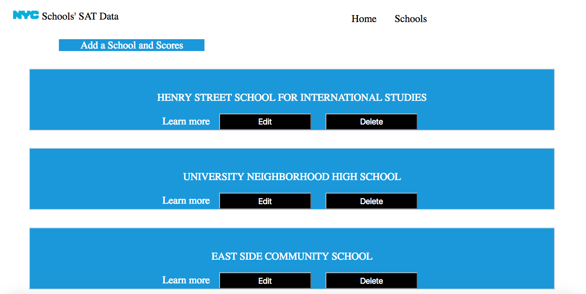
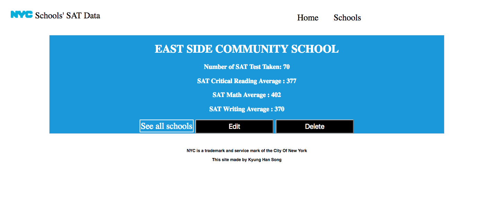

***Kyung Han Song 8/30/17***

## NYC-school-SAT-scores

## What is NYC-school-SAT-scores? 

The app shows a list of NYC schools' average SAT scores. It provides users 
average Math, Writing and Reading scores. Users can create, read, update and delete schools 
that are already in the list.  

# Landing Page, List, Scores 

# Technologies and APIs used

Node js, express, JavaScript, Postgres, SQL

Heroku link : https://nyc-sat-score.herokuapp.com/

# Future expansion 

- APIs from NYC Open Data- SAT results 
- Department Of Education High School Directory  
- Geolocation API to find each school’s location

