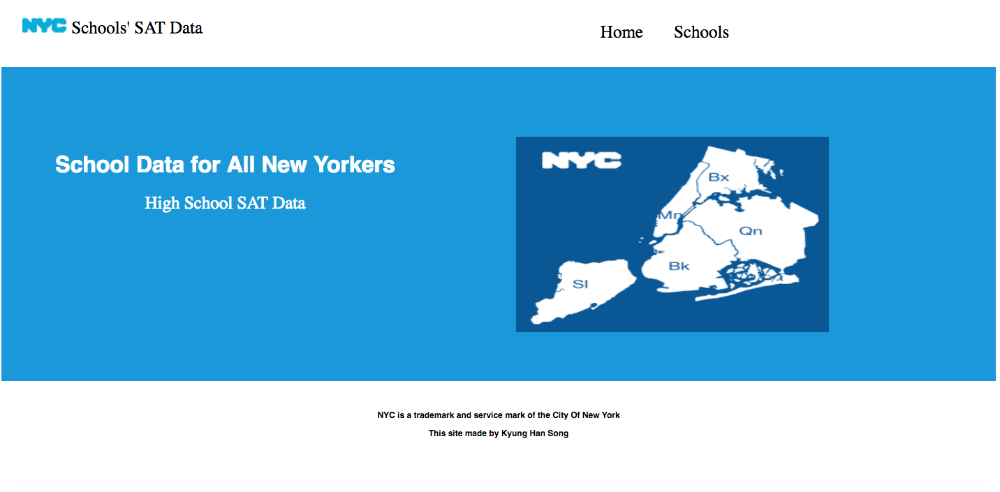

***Kyung Han Song 8/30/17***

## NYC-school-SAT-scores

## What is NYC-school-SAT-scores? 

The app shows a list of NYC schools' average SAT scores. It provides users 
average Math, Writing and Reading scores and school's general information, 
such as address, phone number and email address. Users have options to 
put schools into favorite school section. Users can delete, add or edit schools 
that are already in the list.  

## Wireframe

# Landing Page, List, Scores 

# Technologies and APIs used

Node js, express, JavaScript, Postgres, SQL

Heroku link : https://radiant-forest-10356.herokuapp.com

# Future expansion 

- APIs from NYC Open Data- SAT results 
- Department Of Education High School Directory  
- Geolocation API to find each school’s location

